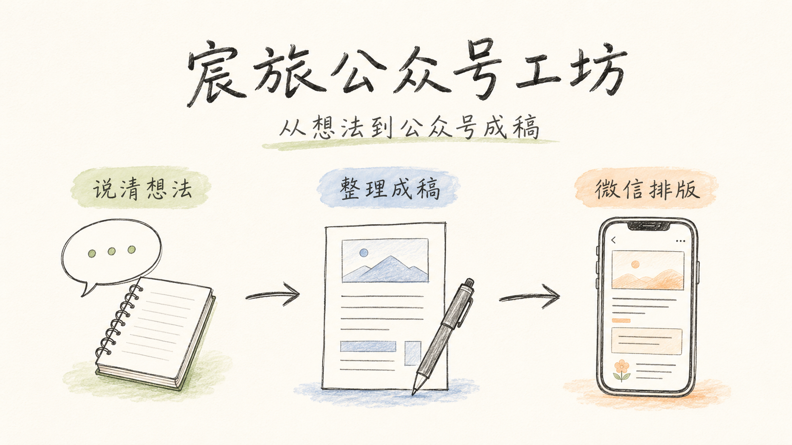

# 3 步把 Markdown 变成公众号草稿

这篇示例只讲一件事：怎么具体使用 `chenly-wechat-studio`。



## 第 1 步：写好 Markdown

文章开头建议写 frontmatter：

```yaml
---
title: "3 步把 Markdown 变成公众号草稿"
author: "Chenly Travel"
digest: "准备 Markdown，先 dry-run 检查，再提交到公众号草稿箱。"
article_type: tutorial
visual_direction: clear-engineering
---
```

最重要的是：

- `title` 会进入公众号标题。
- `digest` 会进入公众号摘要。
- `article_type` 帮助 Skill 判断文章类型。
- `visual_direction` 帮助 Skill 选择审美。

> [!tip] 可以省略
> 如果不写 `article_type` 和 `visual_direction`，也可以使用 `--theme auto` 自动判断。

## 第 2 步：先 dry-run

不要一上来就提交公众号。先生成本地预览和草稿 payload：

```bash
python3 ~/.codex/skills/chenly-wechat-studio/scripts/submit_wechat_draft.py article.md --cover cover.png --theme auto
```

执行后重点检查：

| 文件 | 用途 |
| --- | --- |
| `article.wechat.html` | 本地完整预览 |
| `article.body.html` | 可读正文 HTML |
| `article.submitted.body.html` | 真正提交到微信的正文 |
| `article.draft.json` | 草稿 payload |

:::stat[先看这里]
article.submitted.body.html
微信后台接收的是正文，不是完整网页预览。
:::

## 第 3 步：确认后提交草稿

确认标题、摘要、封面和正文都没问题后，再加 `--submit`：

```bash
python3 ~/.codex/skills/chenly-wechat-studio/scripts/submit_wechat_draft.py article.md --cover cover.png --theme auto --submit
```

真实提交前要满足：

- 本地已经配置微信公众号 AppID/AppSecret。
- 微信后台 IP 白名单包含当前公网 IP。
- `cover.png` 存在。
- 正文里的本地图片可以被上传并改写。

> [!warning] 不要提交密钥
> AppID/AppSecret、access token、media_id、`.env`、`config.yaml`、`*.draft.json` 都不要放进 GitHub。

## 常用调用方式

你也可以直接让 Codex 使用这个 Skill：

```text
用 $chenly-wechat-studio 把 article.md 做成公众号草稿，自动选择审美，并先 dry-run。
```

如果还需要封面：

```text
用 $chenly-wechat-studio 给这篇文章生成动漫风封面，然后生成公众号草稿。
```

:::byline[Chenly Travel]
推荐流程：先写 Markdown，再 dry-run，再看提交正文，最后创建公众号草稿。
:::
